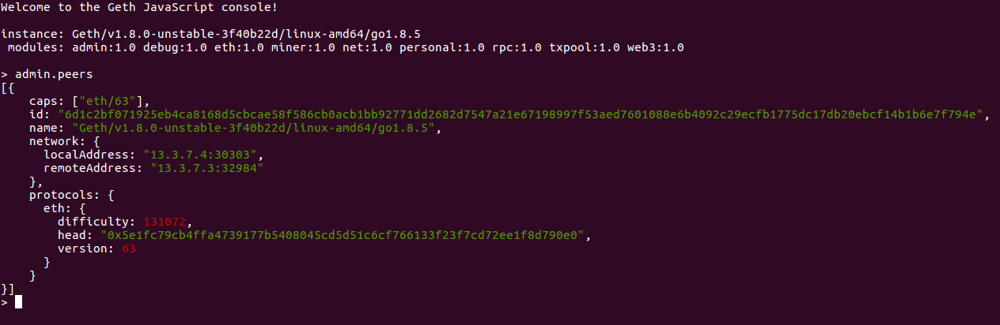

# ethereal

Dockerized Ethereum testnets

- - -

## Requirements

+ [Docker](https://www.docker.com/get-docker)

+ [Docker compose](https://docs.docker.com/compose/)

+ (Optional but recommended) [Geth](https://github.com/ethereum/go-ethereum/wiki/geth)


## Network up

To bring up your ethereal network, run

```commandline
docker-compose up
```


This uses the [`chaingang/ethereal` docker image](https://hub.docker.com/r/chaingang/ethereal/),
build from this repository's [Dockerfile](./Dockerfile).


## Network topology and configuration

Our default network consists of a single bootnode, a single full node, and a single mining node.
For more information about private ethereum networks, refer to the
[ethereum/go-ethereum documentation on the subject](https://github.com/ethereum/go-ethereum/wiki/Setting-up-private-network-or-local-cluster).

The network is specified in [docker-compose.yaml](./docker-compose.yaml). If you would like to deploy a network with a different topology, this is the place to start.


## Working with nodes from docker host

`ethereal` uses [geth](https://github.com/ethereum/go-ethereum/wiki/geth) under the hood as its
default ethereum node implementation.


### JSON-RPC access with `geth`

By default, we expose the [JSON-RPC interface](https://github.com/ethereum/wiki/wiki/JSON-RPC). To
attach to this from your host machine, run

```commandline
geth attach http://localhost:${NODE_RPC_PORT}
```

Here, `$NODE_RPC_PORT` refers to the host port specified for your desired node when you brought up
your network. For our [sample network](./docker-compose.yaml), you can use `NODE_RPC_PORT=8545` for
`node-1` or `NODE_RPC_PORT=8645` for `node-2`.


### IPC access with `geth`

You can also use the IPC API to access administrative functions on the node. To do this from your
host machine, you will have to access the local mount point for your `ethereal` network's `shared`
volume. You can see the path to this mount point using:

```commandline
docker volume inspect ethereal_shared -f "{{.Mountpoint}}"
```

Note that your `$USER` probably does not have permissions to access this directory and so any
commands run against this directory will have to be run with superuser privileges.

To attach to the IPC interface for your desired node, simply run

```commandline
sudo geth attach ipc:$(docker volume inspect ethereal_shared -f "{{.Mountpoint}}")/$NODE_NAME/geth.ipc
```

Here, the `$NODE_NAME` specifies which node you are interacting with. For our
[sample network](./docker-compose.yaml), if you want to connect to `node-1`, you would set
`NODE_NAME=node-1`.

Note that if you built `geth` from source, it probably won't be available under your superuser
`PATH` and you may therefore, in the above command, have to specify the path to your `geth` binary
instead.


## Working with a node from its container

For administrative functions especially, you are better off working with a node from its container.
You can do so by running a `bash` process on that container:

```commandline
docker exec -it $NODE_CONTAINER bash
```

Here, `$NODE_CONTAINER` specifies the name of the container running the desired node. For our
[sample network](./docker-compose.yaml), you can specify `NODE_CONTAINER=ethereal_nod-1_1` to work
with `node-1`.

From this shell, run

```commandline
/opt/go-ethereum/build/bin/geth attach ipc:/opt/shared/$NODE_NAME/geth.ipc
```

for access to the IPC console. Note that you will have to use the appropriate `$NODE_NAME` and also
that you can access the `geth` console for any other node from this container (as a matter of
convenience).


### Example: Checking a node's `admin.peers`

In the [sample network](./docker-compose.yaml), attach to the `node-2` container using:

```commandline
docker exec -it ethereal_node-2_1 bash
```

Attach a `geth` console to the node using:

```commandline
/opt/go-ethereum/build/bin/geth attach ipc:/opt/shared/node-2/geth.ipc
```

In the geth console, run:

```
admin.peers
```

You should see something like this:



Exit the `geth` console using

```
exit
```

Exit from the container using

```commandline
exit
```